# IRIS - Transparency

This project aims to explore following hypothesis:
- When applying Quantitative Input Influence (QII) in layer-by-layer fashion, a pattern of value should show up across levels of layers as well as neurons units within same layer. What will they look like, and can we extract meaningful information from that? The context of experiment is any sophisticated model defined as inheritance of neural network and its variants.

## IRIS DATASET

IRIS dataset is famous for its popularity in AI literature. Though its simplicity, the data is a good starting place to observe the effect of new approach (at least back to 20 years ago) with its visualizability. This dataset consists of 150 samples of 3 classed of ``Iris flowers`` with 50 instances each, together with 4 features: ``Sepal Length``, ``Sepal Width``, ``Petal Length``, and ``Petal Width``. Authors claimed that one class is linearly separable from the others, whereas the latters are not.

To justify the correctness of the claim, I have make several plots cover all possible combinatorial sets of 1, 2 and 3 features. As it shows in **Figure 1** and **Figure 2**, *Iris Setosa* is entirely distinguishable when taking into account of merely ``Petal Length`` feature, but there is no clear cut boundary for the other 2, even in 3-dimensional feature space. It's worth noting that thanks to small number of features and value range, it is feasible to conduct exhaustive sampling-based experiment on this dataset. Furthermore, the value of features are numerical, not categorical, therefore the calculated quantity of interest would be various for each data point. 

<p align="center">
  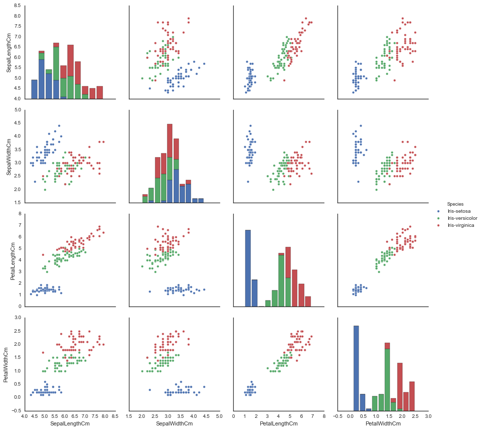
  <br><br>
  <b>Figure 1: Plot of singular feature and pair-wise features of 3 classes of instances.</b><br>
</p>

<p align="center">
  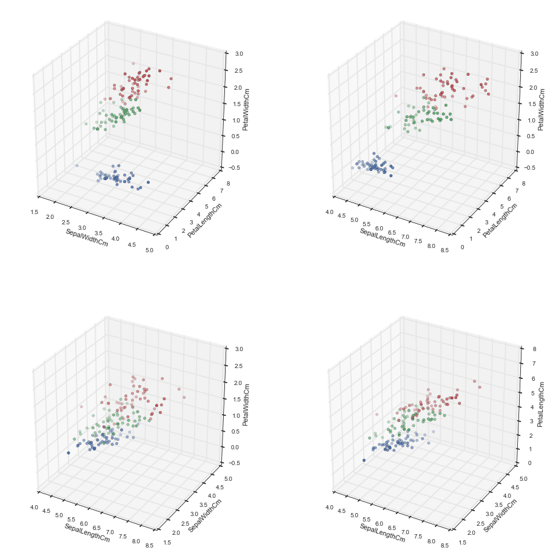
  <br><br>
  <b>Figure 2: Plot of all possible combinations when chosing 3 out of 4 features.</b><br>
</p>

## NEURAL NETWORK ARCHITECTURE

For our goal is observing QII value distributions across different layers, the number of hidden layers is set to 3. In order to set up number of neural units, we based on several rules of thumb (which might or might not be helpful, a debatable topic):
1) Number of units in hidden layer must be in range [``input_nodes``, (``input_nodes``+``output_nodes``)*2/3]
2) Number of units is a sequence of non-increasing number. 
3) To handle non-linearly separable data, we integrate a non-linear function, namely, ``Rectified Linear Unit`` (*ReLU*), or ``f(x) = max(0, x)``.
4) We encode output as 1-hot vector, hence choosing *softmax* function as final filter of output, turn them into a pseudo-probability distribution. Therefore, it is natural to set *Cross-entropy* as loss function. The behind intuition is we are trying to minimize *Kullback-Leibler Divergence*, or disrepancy between predicted and expected probability distribution. 

Given above conditions, we construct a neural network has architecture as in **Figure 3**. It's worth noting that one can achieve 100% accuracy with following structures: ``1000`` > ``800`` > ``600``. However, with a simpler architecture, we can obtain approximated global optimum within 100 epochs.

<p align="center">
  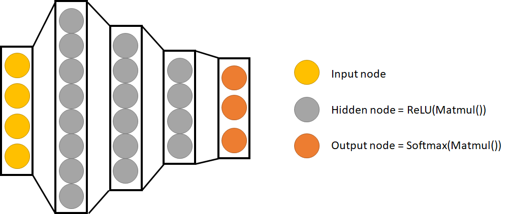
  <br><br>
  <b>Figure 3: Architecture of Neural Network used in experiment setting.</b><br>
</p>

In practice, I made an observation that if the loss of model is not low enough, it seems to be the case that value in both Shapley and Banzhaf for each feature is zero. This could be explained that an immature model works no better than a random outcome of a coin flip, or it's just simply that the size of dataset too small that could not make the model fit well. To push this hypothesis further, we try with ``loss <= 0.5``, still, it's possible to obtain a sequence of zero value here as well. However, in order to minimize the probability this event happens, we ensure the ``loss`` condition holds with ``epoch = 1000``, trained with ``140`` instances and test with ``10`` instances. We see no need to use 10-folds to test the model performance, for the primary object here is training dataset.

<p align="center">
  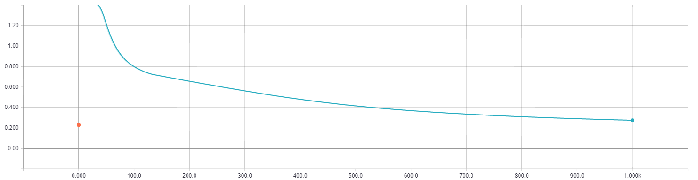
  <br><br>
  <b>Figure 4: Loss (y-axis) of model as number of epoches increasing (x-axis).</b><br>
</p>

<p align="center">
  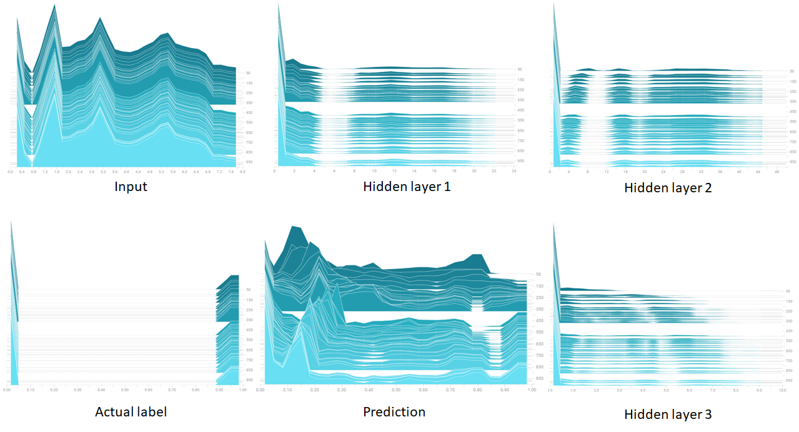
  <br><br>
  <b>Figure 5: Histogram of value of layers as number of epoches increasing (right y-axis). </b><br>
</p>

<p align="center">
  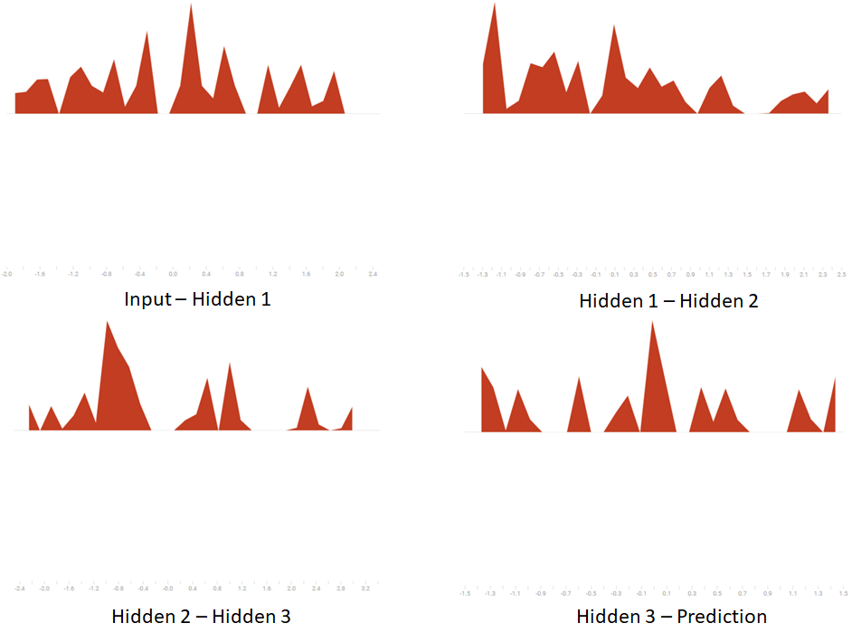
  <br><br>
  <b>Figure 6: Histogram of trained weights of the model.</b><br>
</p>

**Figure 4** shows the model could achieve ``loss <= 0.5`` within 100 epoches, but can still converge to lower value as coming to 1000. This could be a sight of overfitting, but in this scope, it is not a problem need to be addressed. In fact, it could be helpful because we can observe influence of any minor change when manipulating input. **Figure 5** shows evolution of layers from time to time, with hidden layers share similar pattern: peak in zero and uniform in positive side. However, one can see notable fluctuation in prediction layer, though it converges quite soon as stated previously. This implies the weights do matter a lot in final prediction, especially the one connects hidden layer 3 and prediction layer. Despite that reasoning, **Figure 6** shows that weights, once again, quite similar to each other, which deduces that "the root of evil" lies on biases - **Figure 7**.

<p align="center">
  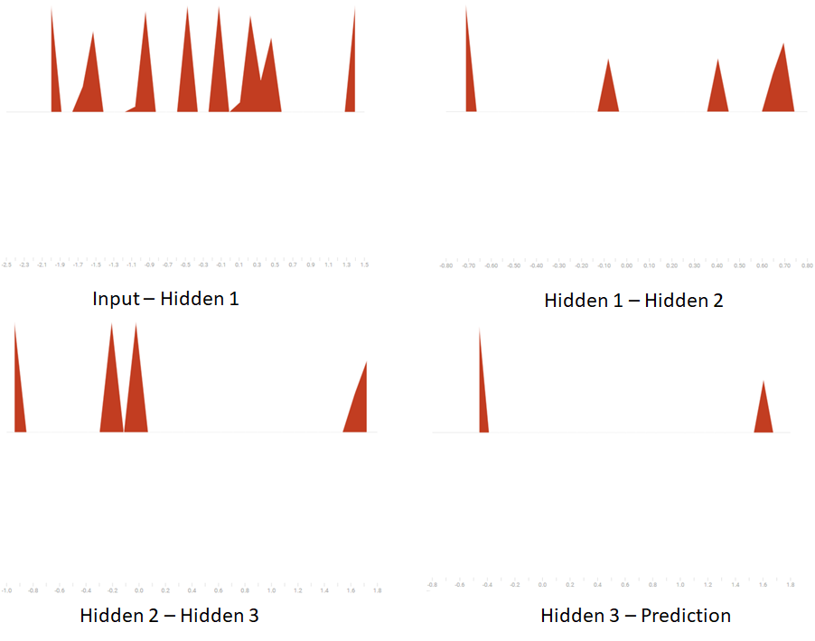
  <br><br>
  <b>Figure 7: Histogram of trained biases of the model.</b><br>
</p>


Even though the hypothesis regarding the correlation between observability of QII and loss of model might be false, I believe this direction is worth being explored deeper. To achieve an acceptable accuracy that could work well on both training and test set, one must reach a safe range of accuracy/loss which is good enough to not be considered underfitting and not too good to be overfitting on training set. However, if this criterion satisfies, but it could not produce any non-zero Shapley/Banzhaf value because it do not reach a certain accuracy level, which is higher than predefined safe zone? Here we can see a trade-off between overfitting and obtaining meaningful result of influence scores. Apparently, this hypothesis does not apply on current model, but we can try on different data set or architecture.


## TRANSPARENCY TEST


Quantitative Input Influence (*QII*) is a class of sampling method that approximately calculate influence for each feature by manipulating them and observe corresponding in the output. This method is model-agnostic, which does not make any assumption on prediction model, hence treat them as blackbox. 

The idea is borrowed from Cooperative Game, in a setting such that we have a set *N* of *n* agents, and utility function *f(x):N->R* that map any possible coalition to utility value. Depends on assumptions made, given any particular coalition, one can calculate marginal contribution for each agent in that coalition. Shapley method assumes that any agents must make a non-negative contribution to its belonging coalition, hence the gap between coalition with and without its existence must be non-negative as well.

Takes over from this, if one priorly knows a set of impactful features, which all sharing a positive or negative correlation (as long as they are in same direction), hence can use Shapley to calculate marginal contribution made by each feature in that chosen set. Pseudo-code below shows how to calculate influence score of feature *i* in feature set *S* in a particular sample *X*:

```python
QII = 0

for i in numb_samplings:
    sequence = permutation(S)
    feature_i = index(sequence)
    sequence_S = sequence[:feature_i-1]
    sequence_S_i = sequence[:feature_i] 
    QII = QII - (change(sequence_S_i) - change(sequence_S))

QII = QII/numb_samplings
```

Another similar and well-used index  is Banzhaf, which simply replace permutation with subset.

```python
QII = 0

for i in numb_samplings:
    sequence = subset(S) contains feature_i
    sequence_S = sequence delete feature_i
    sequence_S_i = sequence
    QII = QII - (change(sequence_S_i) - change(sequence_S))

QII = QII/numb_samplings
```


The ``change`` function is tentative, which could be any numerical change factor in prediction with respect to chosen observed data point. The set of important features in ``change`` would have its value drawn from other samples in training set, whereas the rest stays the same.

Now, we push it further by making one assumption that the model is no longer a blackbox, but a neural network model instead. By doing so, the black turns gray/white, hence we could explore how Shapley distributes in higher level of abstraction of feature, cause there is a common belief that the deeper the layer, the more meaningful the features are.

A few side notes:
- How to choose the set of impactful features?
- How to choose which individual data to test on?
- Neural Network is more biased in classification side. Pretraining with AutoEncoder might helps extracting meaningful feature, but leads to more problems as well. Unfortunately, we could not justify the meaningful of features in tabular datatype, cause it's lack of visualizability.


## EXPERIMENT
 
A handful and lively report of parameters (Weights/Biases) of the Neural Network could be shown by downloading the repository, opening Commandline and direct to the downloaded folder. Enter following command and open browser with address `localhost:6006`. Voilà! 
```bash
tensorboard --logdir=log
```

### Mapback 

As mentioned, QII could analyze not meaningful feature as units in input, but also any layer in Neural Network class. The question is, while they are eligible to calculate, those latent units are not self-explanatory and it's difficult to extract observation from. A natural extension to this is mapping those values back to original input via bridges made of weights. As point out, most of the weights share similar pattern, hence we expect whatever the value is, it would keep extending in that direction. Furthermore, biases play an important role in classification, still, they are dead-end cause 1) there is no inverse-mapping for non-linear function ``relu`` and ``softmax`` and 2) there is no connection from previous layer to current bias unit. However, it's worth noting to test this on fully linear neural network in the future. 

A successful mapback requires 3 parameters:
- Quantity of Interest: ratio of no change in prediction, ``no``, w.r.t. observed data point, or difference ratio, ``diff``, average change in prediction.
- Representation of influence scores on intermediate (hidden) layer: we could ``keep`` them as they are, or convert into ranking (``rank``, the higher the value, the higher the ranking) or normalize (``norm``, using softmax to convert into a pseudo probability distribution).
- Map back technique: current layer do matrix multiplicative operation to transposed (``trans``) or inversed (``inv``) weights that connects to previous layer. One can interprete the operation with transpose matrix as distributing the score proportionally to weights value to previous layer. Besides, we can preprocess the weight before doing that with ``softmax`` (normalize weight to probabilty distribution form), ``shift`` (shift all value to positive side such that lowest value is 0) or both - ``shift_softmax``. The intuition behind shift is that even though if obtained Shapley/Banzhaf value is negative, one can simply shift them to positive side, to show that any agent in coalition always contribute something. 

Table below show all variants we could obtain by combining all three factors.
<p align="center">
  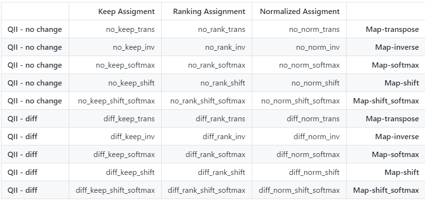
</p>
<!---
||Keep Assigment|Ranking Assignment|Normalized Assigment||
|-|-:|-:|-:|-:|-:|
|**QII - no change**|no_keep_trans|no_rank_trans|no_norm_trans|**Map-transpose**|
|**QII - no change**|no_keep_inv|no_rank_inv|no_norm_inv|**Map-inverse**|
|**QII - no change**|no_keep_softmax|no_rank_softmax|no_norm_softmax|**Map-softmax**|
|**QII - no change**|no_keep_shift|no_rank_shift|no_norm_shift|**Map-shift**|
|**QII - no change**|no_keep_shift_softmax|no_rank_shift_softmax|no_norm_shift_softmax|**Map-shift_softmax**|
|**QII - diff**|diff_keep_trans|diff_rank_trans|diff_norm_trans|**Map-transpose**|
|**QII - diff**|diff_keep_inv|diff_rank_inv|diff_norm_inv|**Map-inverse**|
|**QII - diff**|diff_keep_softmax|diff_rank_softmax|diff_norm_softmax|**Map-softmax**|
|**QII - diff**|diff_keep_shift|diff_rank_shift|diff_norm_shift|**Map-shift**|
|**QII - diff**|diff_keep_shift_softmax|diff_rank_shift_softmax|diff_norm_shift_softmax|**Map-shift_softmax**|
-->


### Shapley - Banzhaf Comparison   

For a same number of n elements, apparently number of permutations is bigger than number of subsets could be constructed from. Therefore, if one calculates Banzhaf and Shapley exhaustively, Banzhaf is definitely a winner, in terms of time performance. On the other hand, if one do the approximation, I will fix number of sampled permutations or subsets and number of drawn samples both as ``600``, hence no significant gap between two methods. Note that even though these 2 both returns similar value, Shapley reflects more truly, according to QII paper. Note that in terms of accuracy and desired characteristics, on the other hands, Shapley is the more appropriare index.

I first compare the time performance with a random data point in table below, for each layer in the model with exhaustive computation using ``no_keep_trans`` mapback. Hidden layer 1 takes most of the time is reasonable, because it has largest number of units in one layer. As expected, Banzhaf always needs lower time to execute.

||Shapley (secs)|Banzhaf (secs)|
|-|-:|-:|
|Input Layer|0.0792|0.0521|
|Hidden Layer 01|196.6885|1.2593|
|Hidden Layer 02|2.2159|0.2797|
|Hidden Layer 03|0.0732|0.0602|

We evaluate Shapley and Banzhaf and plot their corresponding mapped value in input layer on **Figure 8**, **Figure 9**, which shows consistency in both methods. Despite slight difference in value, the tendency is crystal clear. A drastic change in hidden layer 3 is notable, hence further investigation required. We would be back to this later.

<p align="center">
  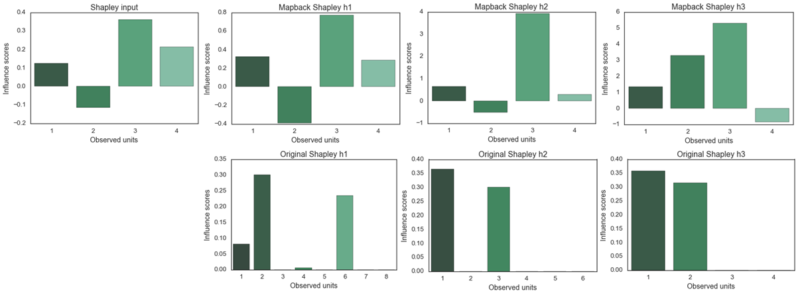
  <br><br>
  <b>Figure 8: Shapley value through different layers. 1st Row: input layer and mapback value on input layer. 2nd Row: original value on corresponding hidden layers.</b><br>
</p>

<p align="center">
  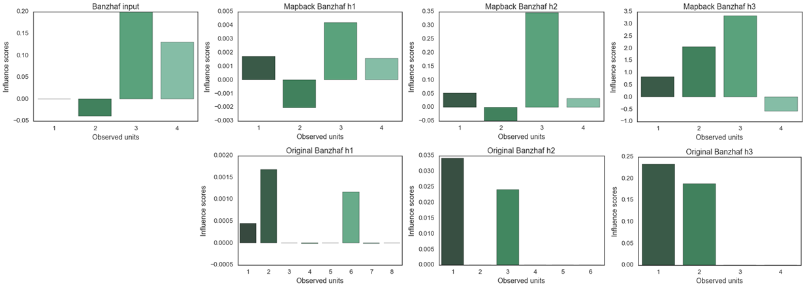
  <br><br>
  <b>Figure 9: Banzhaf value through different layers. 1st Row: input layer and mapback value on input layer. 2nd Row: original value on corresponding hidden layers.</b><br>
</p>

### How good is sampling-based method

To evaluate actual Shapley value, in case of numerous features, one cannot simply wait until it finishes. In order to address this issue, sampling-based method are proposed. We set ``n_perms``/``n_subsets`` = 600 and ``n_pool_samples`` = 600 as well, to achieve acceptable confidence level and accurary theoretically. Table below shows disrepency between 2 methods: exhaustive and approximation on hidden layer 1, the layer has most number of units.

||Node 1|Node 2|Node 3| Node 4| Node 5| Node 6| Node 7| Node 8|
|-|-:|-:|-:|-:|-:|-:|-:|-:|
|Exhaustive Shapley|0.0538| 0.4264| 0.| 0.0318| 0.| 0.0669|0.0639| 0.|
|Approximate Shapley| 0.0701| 0.3353| 0.| 0.0156| 0.| 0.0991| 0.0656| 0.|
|Exhaustive Banzhaf|1.8565e-04| 1.2061e-03| 0.| 9.9206e-06| 0.| 1.3747e-04| 7.2279e-05| 0.|
|Approximate Banzhaf| 0.0657| 0.3601| 0.| 0.0023| 0.| 0.0736| 0.0337| 0.|

This does not imply approximation can work well on big data set for we have ``n_pool_samples`` = ``size_train_dataset`` in this toy dataset. Fortunately, we are dealing with a small dataset, hence following experiments would be evaluated with exhaustive method.

### Selection of observed data

We need a groundtruth of actual effect of each feature on data. Because it's hard to obsevere on 3D and 4D data space, I decide to choose a 2D data space that is nearly linearly separable and observe influence score for 2 kind of specific data point: the one lies on centroid of its cluster and the one on the boundary between clusters. Table below shows index of data point I have chosen in original dataset.

||Centroid|Boundary 1|Boundary 2|
|-|-:|-:|-:|
|Iris-setosa (blue)| 20| 44| |
|Iris-versicolor (green)| 91| 61| 71|
|Iris-virginica (red)|105|135| |

**Figure 10** shows the chosen pair of feature that we expect to see a pattern in ``SepalLengthCm`` and ``PetalWidthCm``, ``feature 1`` and ``feature 4``, respectively. We conduct experiment by testing all 7 points with ``no_keep_trans`` mapback technique on all layers. Note that Banzhaf shows similar result to Shapley, let alone the fact that Shapley is considered to have more characteristics that requires in influence score, therefore we shows merely Shapley graph on **Figure 11**.

<p align="center">
  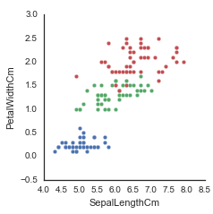
  <br><br>
  <b>Figure 10: Chosen feature pair for observation: SepalLengthCm and PetalWidthCm.</b><br>
</p>

<p align="center">
  
  <br><br>
  <b>Figure 11: Mapback Shapley value of 7 typical points, feature 1 and 4. Order: setosa-centroid, setosa-bound, versicolor-bound, versicolor-centroid, versicolor-bound, virginica-bound, virginica-centroid</b><br>
</p>

We define the set of important features consisting of ``feature 1`` and ``feature 4``. As shown in  **Figure 11**, a pattern of correlation between 2 features giving us a hint to determine the predicted class of data points. We also test with all features in each layers, but no clear trend can be identified (**Figure 12**). This is in our expectation, because set all features equally important is no other than calculate Global Shapley value of the model. However, by making further observations in all-feature set, we see clearer pattern in higher levels when retaining obtained value instead mapping, especially hidden layer 3 (**Figure 13**). **Figure 13** shows that in hidden layer 2 and 3, less features active, hence we can select those activated features as important features and see is there any difference would be made. Therefore, we compare manually selected features with all features in hidden layers. Unfortunately, **Figure 14** shows no significant change when you emphasize the features on hidden layer 2 that active in global evaluation. We achieve similar result with hidden layer 3, which does not show here.


<p align="center">
  
  <br><br>
  <b>Figure 12: Mapback Shapley value of 7 typical points, all 4 features. Row order: setosa-centroid, setosa-bound, versicolor-bound, versicolor-centroid, versicolor-bound, virginica-bound, virginica-centroid. Column order: input, hidden layer 1, hidden layer 2, hidden layer 3</b><br>
</p>

<p align="center">
  
  <br><br>
  <b>Figure 13: Original value of 7 typical points, all 4 features. Row order: setosa-centroid, setosa-bound, versicolor-bound, versicolor-centroid, versicolor-bound, virginica-bound, virginica-centroid. Column order: input, hidden layer 1, hidden layer 2, hidden layer 3</b><br>
</p>

<p align="center">
  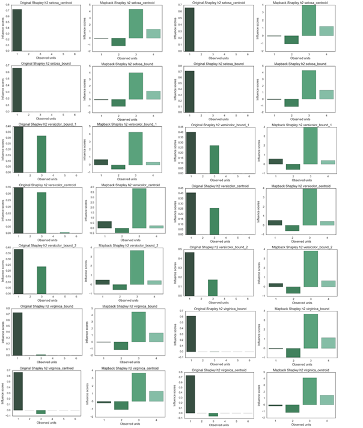
  <br><br>
  <b>Figure 14: Comparison of Shapley value between choosing all features and feature 1 + 3 only in hidden layer 2. Row order: setosa-centroid, setosa-bound, versicolor-bound, versicolor-centroid, versicolor-bound, virginica-bound, virginica-centroid. Column order: 6 features-hidden layer 2, mapback to input layer, 2 features-hidden layer 2, mapback to input layer</b><br>
</p>

### Selection of mapback method

Once the data point has been set, we now want to observe effect of 3 factors (quantity of interest, representation of influence scores, and mapback method) when doing mapback. We chose ``iris_versicolor_centroid`` as observed data point, and run all variants of mapback method on hidden layer 3.

<p align="center">
  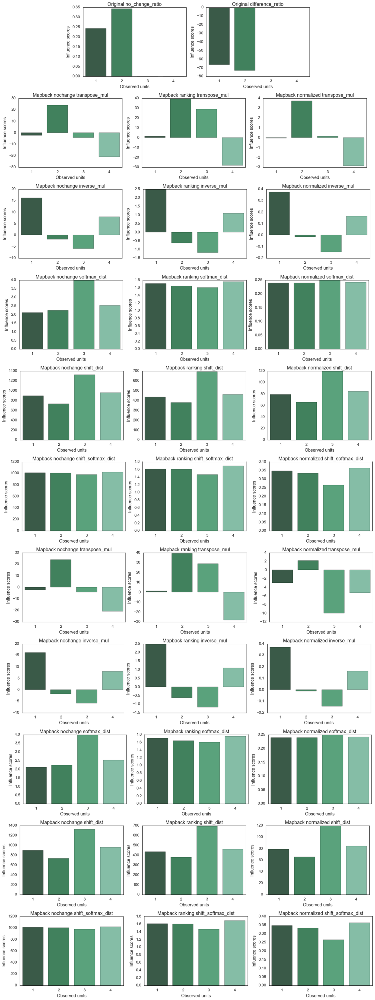
  <br><br>
  <b>Figure 15: Mapback method comparison. 1st row is original Shapley value in hidden layer 3 and other rows are corresponding combinations to table explained previously.</b><br>
</p>

I have no conclusion for this part, it would be more helpful if we can investigate on meaningful hidden layers. Convolutional Neural Network is a natural extenstion.

## TODO

- Compare to LIME and MIM
- Extend to linear NN
- Try on CNN (mapback problem?!)
- Trade-off between overfitting and obtaining meaningful result of influence scores

## ACKNOWLEDGEMENT

- Thank you Ben Hammer for his wonderful [plot tutorial](https://www.kaggle.com/benhamner/python-data-visualizations) of IRIS. 
- Thank you EdoVaira for his/her useful [tutorial](https://github.com/EdoVaira/Iris-Neural-Network/blob/master/Iris_Network.py) of training 1-hidden layer NN on IRIS dataset.
- OOP-style in designing [tensorflow graph](https://stackoverflow.com/questions/37770911/tensorflow-creating-a-graph-in-a-class-and-running-it-ouside).
- Thank you Nathan Brixius for tutorial on [save/load weights](ttps://nathanbrixius.wordpress.com/2016/05/24/checkpointing-and-reusing-tensorflow-models/)  in Tensorflow.
- Determining number of [hidden units](http://www.faqs.org/faqs/ai-faq/neural-nets/part3/section-10.html) and their [ratio](https://www.kaggle.com/louisong97/neural-network-approach-to-iris-dataset).
